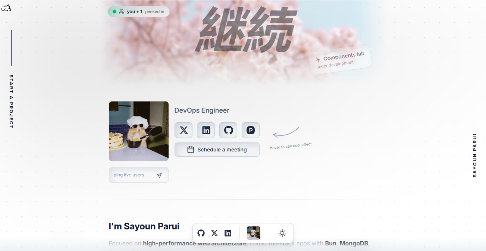

  

   
   

  <h1>Sayoun Parui   Full Stack AI Engineer</h1>

  
  
  
  
  
  

  

    <b>The Next-Gen Developer Portfolio</b> 
    <i>Interactive. Real-time. Motion-driven.</i>
  

---

## ⚡ Overview

This isn't just a static resume it's an **immersive digital experience**. Built with the latest web technologies, this portfolio showcases projects with high-fidelity animations, real-time user tracking, and a command-center interface. 

Designed to feel like a premium product, it bridges the gap between functional utility and artistic expression.

## ✨ Key Features

| Feature | Description |
| :--- | :--- |
| **🎨 Dynamic Theming** | Seamless **Dark/Light mode** switching with deep, glossy aesthetic touches. |
| **🔴 Live Presence** | Real-time **visitor counter** and **ping chat** powered by Supabase. See who's online! |
| **🌊 Liquid Motion** | Silky smooth transitions using **Framer Motion** |
| **📊 GitHub Heatmap** | Custom-styled contribution graph to showcase coding activity. |
| **📱 Responsive Dock** | MacOS-style **Bottom Dock** for intuitive mobile and desktop navigation. |
| **📹 Video Previews** | Autoplaying, muted project previews for instant visual context. |

## 🛠️ Tech Stack Upgrade

This project runs on the bleeding edge:

- **Framework**: React 19 + TypeScript
- **Build Tool**: Vite (Blazing fast HMR)
- **Styling**: Tailwind CSS v4 (The latest engine)
- **Animation**: Framer Motion 12 + Lucide Icons
- **Backend**: Supabase (Real-time DB)
- **Routing**: React Router 7

## 🚀 Quick Start

Get this portfolio running locally in seconds.

### 1. Clone & Install
`
git clone https://github.com/SayounParui/Portfolio.git
cd Portfolio
npm install
`

### 2. Environment Setup
Create a .env file in the root directory and add your Supabase credentials to enable real-time features:
`
VITE_SUPABASE_URL=your_supabase_url
VITE_SUPABASE_ANON_KEY=your_supabase_anon_key
`

### 3. Run Development Server
`
npm run dev
`

### 4. Build for Production
`
npm run build
`

## 🤝 Connect

Let's build something amazing together.

  
  
  

---

  
© 2026 Sayoun Parui. Crafted with 🖤 and React.

